<div align="center">

# 🐝 Open Swarm

### MCP Server + OpenCode Agent for Emergent Multi-Agent Cooperation

[](https://opensource.org/licenses/MIT)
[](https://docs.github.com/copilot)
[](https://modelcontextprotocol.io)
[](https://arxiv.org/abs/2602.16301)
[](https://github.com/anomalyco/opencode)
[](#changelog)

*Cooperation isn't programmed — it **emerges**.*

---

</div>

## 💡 The Idea

Traditional multi-agent systems use a **central coordinator** that tells each agent what to do. This skill takes a fundamentally different approach based on research from [arXiv:2602.16301](https://arxiv.org/abs/2602.16301) (Wołczyk, Weis, Nasser et al., 2026):

> **Cooperation emerges naturally** when diverse agents adapt to each other through anonymous interaction history and mutual shaping pressure.

No central brain. No rigid pipelines. Just diverse agents reading each other's work, adapting, challenging, and converging on quality.

```
Traditional:     Controller → Agent A → Agent B → Agent C → Output
                     ↑ centralized decisions at every step

Swarm:           Agent A ←→ Agent B ←→ Agent C → Consensus
                     ↑ agents shape each other through interaction
```

---

## 🧬 How It Works — The Paper's Mechanism

The paper identifies a causal chain that produces cooperation (§3.2). This skill translates each step into practical agent orchestration:

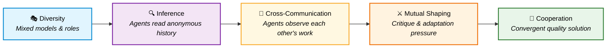

| Step | Paper Mechanism | Skill Implementation |
|------|----------------|---------------------|
| **1. Diversity** | Train agents against diverse co-player pool (§3.1) | Use ≥2 different LLM models (Opus, Sonnet, GPT, Gemini) |
| **2. In-Context Inference** | Agents infer co-player strategy from observations (§3.2) | Each agent receives full anonymous interaction history |
| **3. Cross-Communication** | Agents observe and react to each other's outputs (§3.2) | Parallel coders see other workstreams; critics see all changes |
| **4. Mutual Shaping** | Adaptiveness creates vulnerability → pressure to cooperate (§3.2) | Critics score work; low scores trigger revision with cross-awareness |
| **5. Convergence** | Cooperation emerges as stable equilibrium (§4) | Quality ≥7/10 across all agents → consensus achieved |

---

## 🛫 Quick Start

### Option A: OpenCode (Recommended — enforced orchestration)

```bash
# Install OpenCode
brew install opencode

# Authenticate with GitHub Copilot
opencode auth login  # Select "GitHub Copilot" → device code flow

# Copy agent configs
cp opencode/agents/*.md ~/.config/opencode/agents/

# Add MCP server to ~/.config/opencode/opencode.json
# (see Installation section below)

# Launch the swarm
alias swarm='opencode --agent swarm'
swarm
```

### Option B: Copilot CLI (skill-based, no tool enforcement)

```bash
mkdir -p ~/.copilot/skills/swarm-orchestrator && \
  curl -sL https://raw.githubusercontent.com/schwarztim/open-swarm/main/SKILL.md \
  -o ~/.copilot/skills/swarm-orchestrator/SKILL.md
```

---

## 🤖 Agent Architecture (OpenCode)

### 3-Level Hierarchy (arXiv:2602.16301 §3.2)

The system implements a **3-level agent hierarchy** inspired by the paper's cooperative dynamics:

```
Level 1: Orchestrator (swarm)     → MCP protocol + task() dispatch only
Level 2: Workers (worker-*)       → Full toolset + task() for sub-delegation
Level 3: Sub-agents (worker-*)    → Full toolset, NO further task() dispatch (depth limit)
```

The orchestrator delegates to workers, and workers can further delegate to sub-agents when a workstream has multiple independent parts. This maps to the paper's mechanism:

- **Diversity** (§3.1): Each level uses different providers (Anthropic/OpenAI/Gemini). Workers MUST dispatch to a different provider than themselves.
- **Anonymous interaction** (§3.2): Sub-agents receive task context without knowing the parent worker's approach or identity.
- **Mutual shaping** (§3.2): Workers synthesize sub-agent outputs, looking for convergence (agreement) and novel insights (disagreement).
- **Depth limit**: Sub-agents cannot spawn further sub-agents — prevents runaway agent trees.

| Agent | Level | Role | Model | Tools |
|-------|-------|------|-------|-------|
| **swarm** | 1 | Orchestrator | claude-sonnet-4 | MCP tools (8) + `task()` |
| **worker-anthropic** | 2-3 | Anthropic worker | claude-sonnet-4 | Full toolset + `task()` |
| **worker-openai** | 2-3 | OpenAI worker | gpt-5.2-codex | Full toolset + `task()` |
| **worker-gemini** | 2-3 | Google worker | gemini-3-pro-preview | Full toolset + `task()` |
| **worker-haiku** | 2-3 | Fast/merge worker | claude-haiku-4.5 | Full toolset + `task()` |
| **worker** | 2-3 | Default fallback | claude-sonnet-4 | Full toolset + `task()` |

### Provider-Based Dynamic Routing via `subagent_type`

The MCP server assigns models to workstreams and returns a `subagent_type` field matching an OpenCode worker agent name. The swarm agent passes this directly to `task(subagent_type=...)`. **No model names are hardcoded** — when new models are added to any provider, they auto-route without config changes.

```
MCP returns subagent_type="worker-anthropic"  → task(subagent_type="worker-anthropic", ...)
MCP returns subagent_type="worker-openai"     → task(subagent_type="worker-openai", ...)
MCP returns subagent_type="worker-gemini"     → task(subagent_type="worker-gemini", ...)
```

### Cross-Provider Sub-Delegation

Workers dispatch sub-agents to **different providers** for diversity:

```
worker-anthropic (Claude) → spawns worker-openai (GPT) + worker-gemini (Gemini)
worker-openai (GPT)       → spawns worker-anthropic (Claude) + worker-gemini (Gemini)
worker-gemini (Gemini)    → spawns worker-anthropic (Claude) + worker-openai (GPT)
```

---

## 🏗️ Architecture

### Orchestration Flow

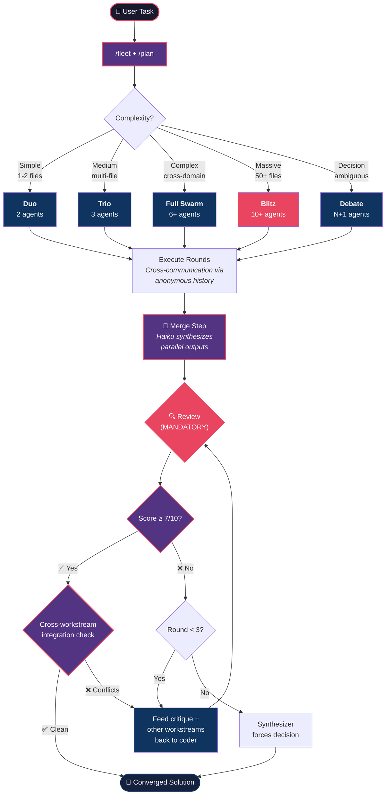

### Tiered Modes

<table>
<tr>
<td width="20%" align="center">

**🟢 Duo**
<br/>2 agents · ~3 calls
<br/><sub>Implementation + review</sub>

</td>
<td width="20%" align="center">

**🟡 Trio**
<br/>3 agents · ~6 calls
<br/><sub>Design + code + validation</sub>

</td>
<td width="20%" align="center">

**🔴 Full Swarm**
<br/>6+ agents · ~14 calls
<br/><sub>Architecture, security-critical</sub>

</td>
<td width="16%" align="center">

**⚡ Blitz**
<br/>10+ agents · ~20+ calls
<br/><sub>Massive codebases, 50+ files</sub>

</td>
<td width="16%" align="center">

**🟣 Debate**
<br/>N+1 agents · ~3N+1 calls
<br/><sub>Design decisions, tradeoffs</sub>

</td>
<td width="16%" align="center">

**🔥 Unleashed**
<br/>32 parallel agents · subprocess mode
<br/><sub>"Make it hurt" — max parallelism</sub>

</td>
</tr>
</table>

---

## 🔄 Detailed Flows

### Duo Flow

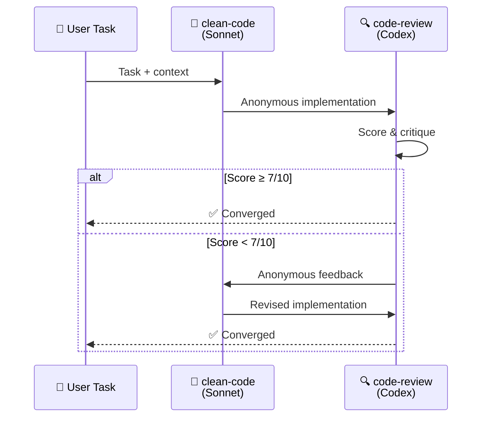

### Trio Flow

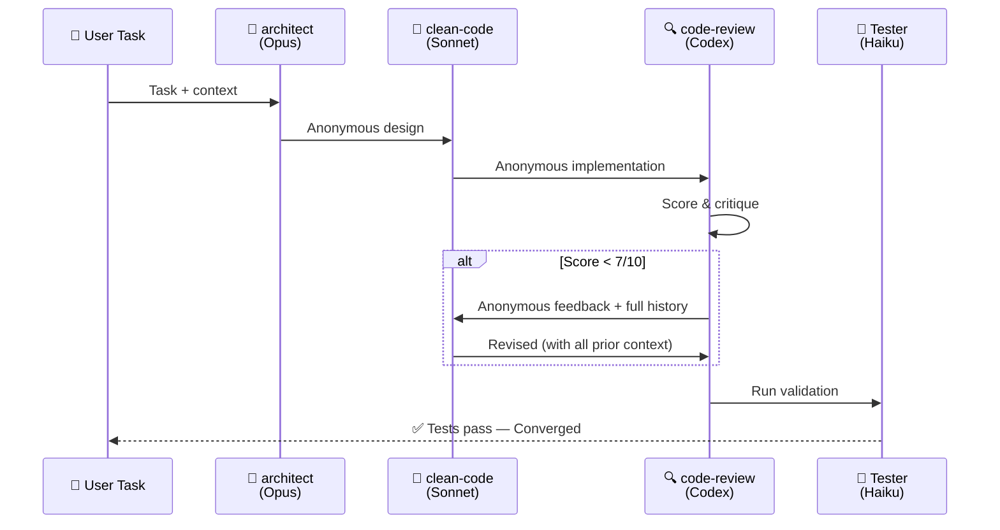

### Full Swarm Flow

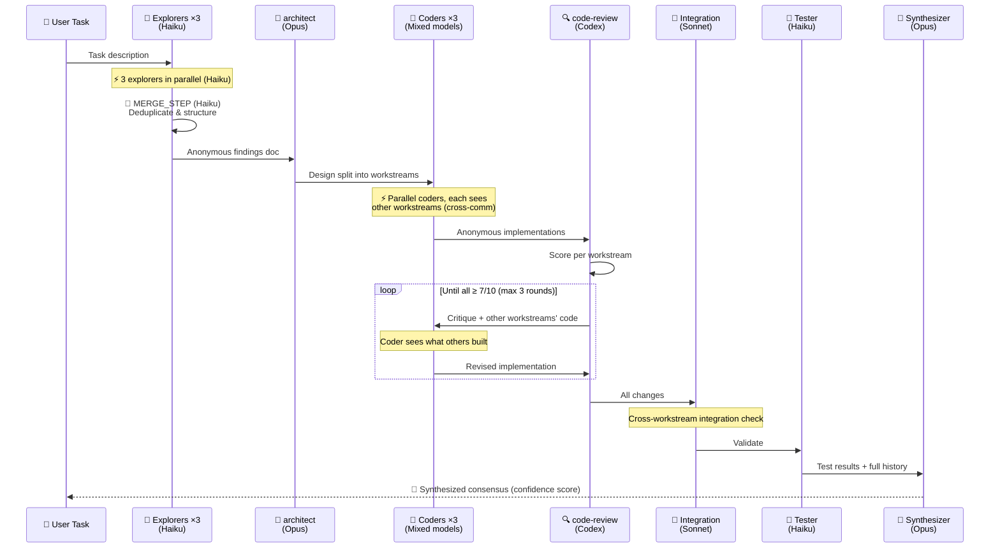

### Debate Flow

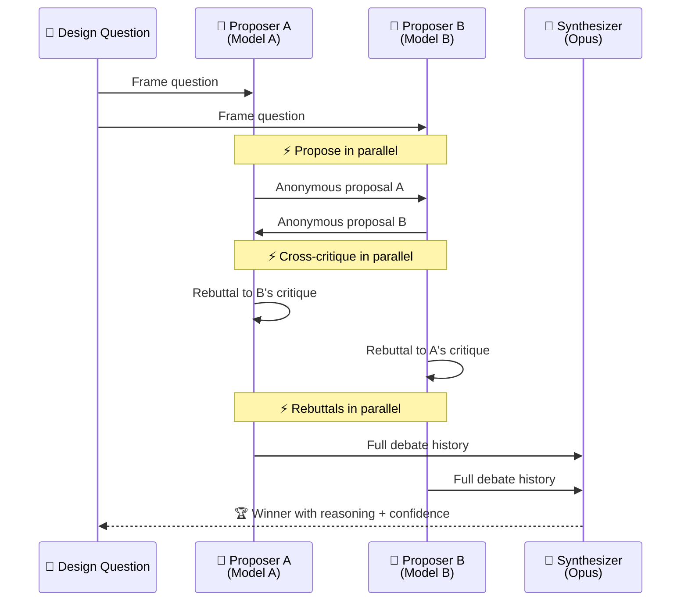

### L2 Manager Debate Flow (NEW — v14.0)

When an L2 Manager detects worker disagreement, it runs a structured debate
via `swarm_debate` without escalating to L1. Based on
[Agent-Skills multi-agent-patterns](https://github.com/muratcankoylan/Agent-Skills-for-Context-Engineering/tree/main/skills/multi-agent-patterns):
adversarial critique, weighted voting, sycophancy detection.

```mermaid
sequenceDiagram
    participant L1 as 🎯 L1 Orchestrator
    participant M as 📋 L2 Manager
    participant MCP as 🐝 MCP Server
    participant W1 as 🔨 Worker 1
    participant W2 as 🔨 Worker 2
    
    L1->>M: Dispatch group
    M->>W1: Assign task
    M->>W2: Assign task
    Note over W1,W2: ⚡ Parallel execution
    W1-->>M: Output A
    W2-->>M: Output B (conflicting!)
    
    Note over M: ⚠️ Disagreement detected
    M->>MCP: swarm_debate(start, trigger=disagreement)
    MCP-->>M: debateId, participants
    
    rect rgb(40, 40, 80)
        Note over M,W2: 🔥 DEBATE ROUND 1
        M->>MCP: swarm_debate(next)
        MCP-->>M: position prompts
        M->>W1: Position task (anonymous)
        M->>W2: Position task (anonymous)
        W1-->>M: Position A
        W2-->>M: Position B
        M->>MCP: swarm_debate(submit) ×2
        
        M->>MCP: swarm_debate(next)
        MCP-->>M: critique prompts
        M->>W1: Critique B (anonymous)
        M->>W2: Critique A (anonymous)
        W1-->>M: Critique of B
        W2-->>M: Critique of A
        M->>MCP: swarm_debate(submit) ×2
        
        M->>MCP: swarm_debate(next)
        MCP-->>M: rebuttal prompts
        M->>W1: Defend/revise
        M->>W2: Defend/revise
        W1-->>M: Rebuttal
        W2-->>M: Rebuttal
        M->>MCP: swarm_debate(submit) ×2
    end
    
    M->>MCP: swarm_debate(evaluate)
    MCP-->>M: convergence + sycophancy check
    
    alt Converged
        M->>MCP: swarm_debate(synthesize)
        MCP-->>M: synthesis prompt
        M->>M: Produce final decision
        M-->>L1: Report with synthesis
    else Stalled
        M->>MCP: swarm_debate(escalate)
        M-->>L1: Report with ESCALATION
        L1->>L1: Boss makes the call
    end
```

#### Debate Scoring Dimensions

| Dimension | Max | What It Measures |
|-----------|-----|-----------------|
| Evidence Quality | 3 | Code refs, data, concrete examples |
| Reasoning Clarity | 3 | Logical structure, causal chains |
| Rebuttal Effectiveness | 3 | Addressed critiques with new evidence |
| Novel Contribution | 2 | Unique insights not in other positions |

#### Sycophancy Detection Signals

| Signal | What It Detects |
|--------|----------------|
| Rebuttal collapse | Rebuttals <30% length of positions |
| Hollow agreement | Agreement markers without substantive reasoning |
| Soft critiques | 3:1 ratio of hedging vs substantive critique markers |
| Position mimicry | Positions copying each other's prior content |
| Minimal defense | "Position unchanged" with <200 chars |

### Blitz Flow (Maximum Throughput)

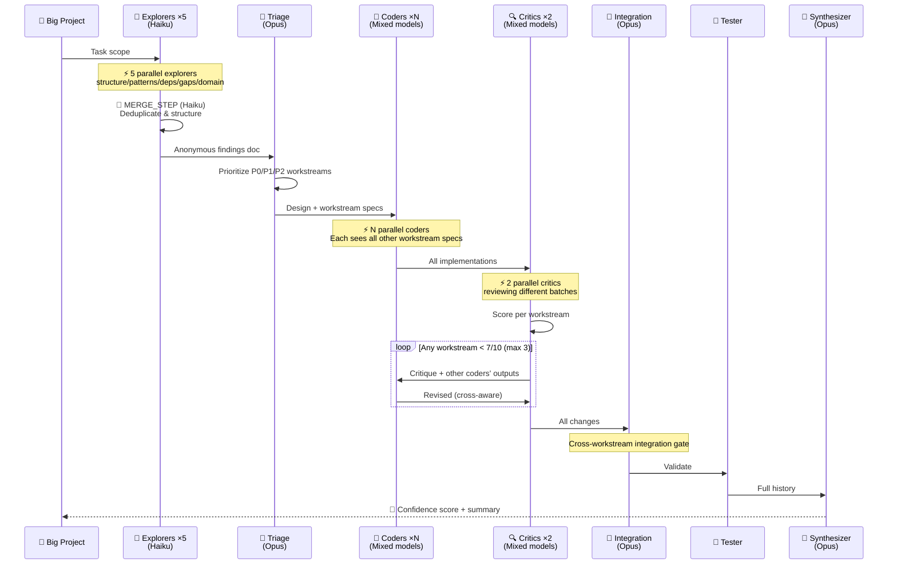

### Unleashed Flow (Maximum Pain)

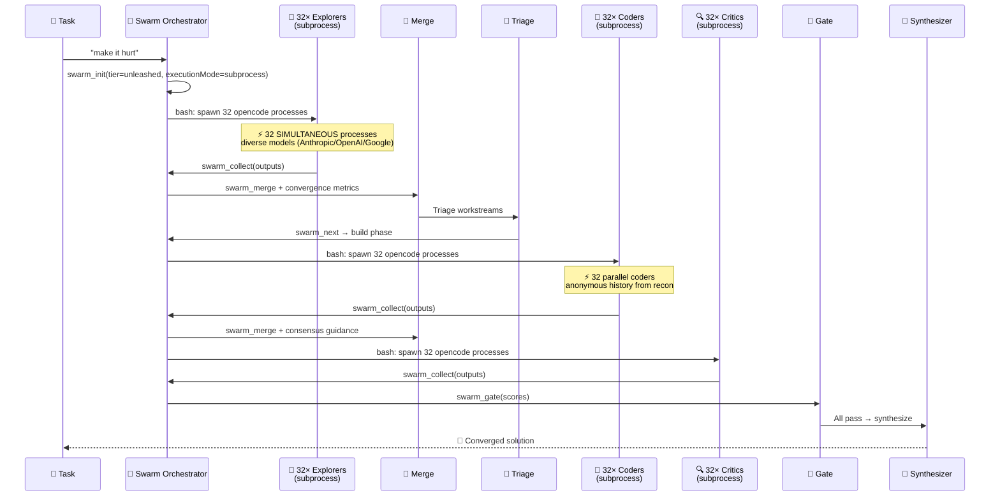

---

## 🚀 Execution Modes

### Task Mode (default, recommended)
The swarm agent dispatches work to `worker-*` subagents via OpenCode's native `task()` tool. Each `task()` call creates a child session with its own context window, linked to the parent via `parentID`. The orchestrator can dispatch multiple `task()` calls in a single turn for parallel execution, or use OpenCode's `batch` tool for guaranteed parallelism.

```
# What task mode does under the hood:
task(subagent_type="worker-anthropic", description="Implement auth module", prompt="...")
task(subagent_type="worker-openai", description="Write API routes", prompt="...")
task(subagent_type="worker-gemini", description="Create test suite", prompt="...")
```

**Key advantage:** Sessions are navigable (Leader+Right/Left), `task_id` enables session resumption, and the model is determined by the worker agent's config — not hardcoded per call.

### Subprocess Mode (unleashed/advanced)
The swarm agent spawns **independent `opencode run` processes** via bash. Each process runs in its own terminal with its own context window. True OS-level parallelism — your CPU will feel it.

```bash
# What subprocess mode actually does:
opencode run "<prompt>" --agent worker-anthropic --dangerously-skip-permissions > /tmp/swarm-xxx/ws-0-output.md &
opencode run "<prompt>" --agent worker-openai --dangerously-skip-permissions > /tmp/swarm-xxx/ws-1-output.md &
opencode run "<prompt>" --agent worker-gemini --dangerously-skip-permissions > /tmp/swarm-xxx/ws-2-output.md &
# ... × 32 for unleashed mode
wait
```

---

## 📊 Convergence Metrics (arXiv:2602.16301 §4)

The MCP server tracks convergence across rounds:

| Metric | Description |
|--------|-------------|
| `currentAvg` | Average quality score this round |
| `previousAvg` | Average quality score last round |
| `delta` | Improvement between rounds |
| `stalling` | `true` if delta < 0.5 (agents stuck) |
| `trend` | Array of all round averages |

When **stalling** is detected, the merge agent receives special guidance:
> *"The swarm is stalling. Look for novel, outlier ideas that might break the deadlock. Be bold."*

When **converging well** (delta > 0.5):
> *"Refine details and polish. Focus on consistency."*

---

## 🔗 Programmatic Communication Layer (v13.0)

The paper's core finding: **cooperation emerges through mutual observation and adaptation, not isolation**.

Previous versions used prompt instructions to coordinate agents. **v13.0 makes communication programmatic** — the MCP server manages all inter-agent communication through two new tools:

### The Board — `swarm_relay` + `swarm_board`

```
┌────────────────────────────────────────────────────────────────┐
│                    ORCHESTRATOR (Premium Model)                 │
│   Makes hard decisions. Always presented facts, never noise.   │
│                                                                │
│   ┌──── swarm_relay ────┐       ┌──── swarm_board ────┐       │
│   │ Post findings from  │       │ Read all findings,  │       │
│   │ completed workers   │       │ blockers, decisions  │       │
│   └─────────┬───────────┘       └─────────┬───────────┘       │
│             │                             │                    │
│     ┌───────▼─────────────────────────────▼──────────┐        │
│     │           MCP SERVER STATE (board[])            │        │
│     │  - Strips identity (arXiv §3.2 anonymity)      │        │
│     │  - Auto-injects into swarm_next prompts        │        │
│     │  - Tracks blockers & dependencies              │        │
│     │  - ws-0 NEVER sees its own findings            │        │
│     └───────┬────────────┬────────────┬──────────────┘        │
│             │            │            │                        │
│        ┌────▼───┐  ┌─────▼──┐  ┌─────▼──┐                    │
│        │ ws-0   │  │ ws-1   │  │ ws-2   │  Worker Agents      │
│        │sees 1,2│  │sees 0,2│  │sees 0,1│  (get board ctx)    │
│        └────────┘  └────────┘  └────────┘                    │
└────────────────────────────────────────────────────────────────┘
```

### How It Works (Programmatic, Not Prompt-Based)

1. **Orchestrator dispatches workers** → calls `swarm_next`, gets `task()` parameters
2. **Worker completes** → orchestrator calls `swarm_submit(output=...)` 
3. **MCP auto-posts to board** → `swarm_submit` automatically relays anonymized output as a `finding`
4. **Orchestrator can post manually** → `swarm_relay(type="blocker", ...)` to flag issues
5. **Next dispatch includes board** → `swarm_next` auto-injects `--- FINDINGS FROM OTHER WORKSTREAMS ---` into prompts
6. **Each worker sees only OTHER workers' findings** → anonymous, no self-reference

### Message Types

| Type | Who Posts | Effect |
|------|----------|--------|
| `finding` | Auto (via submit) or orchestrator | Shared with other workstreams in next dispatch |
| `blocker` | Orchestrator | Halts dependent workstreams, requires `decision` to resolve |
| `decision` | Orchestrator only | Resolves blockers, recorded permanently |
| `status` | Orchestrator | Progress tracking, no dispatch effect |

### Orchestrator Decision Loop

```
while (session not complete):
  board = swarm_board(sessionId)          # Read facts
  if board.unresolvedBlockers > 0:
    swarm_relay(type="decision", ...)     # Make the hard call
  ready = board.workstreams.ready         # What can run?
  tasks = swarm_next(sessionId)           # Get task calls
  for task in tasks:
    result = task(subagent_type=..., prompt=...)  # Dispatch
    swarm_submit(output=result)           # Auto-relays to board
```

The orchestrator's only job is **making decisions**. All communication, identity stripping, context injection, and dependency tracking is handled by the MCP server.

---

## 📊 Quality Scoring System

Every contribution is scored to create the **gradient pressure** that drives improvement:

```
┌─────────────────────────────────────────────────────┐
│                  QUALITY SCORE                       │
│                                                     │
│  Correctness      ████████░░  2/3  Solves problem?  │
│  Responsiveness   █████████░  3/3  Addressed feedback│
│  Constructiveness ██████░░░░  1/2  Improved quality? │
│  Novelty          ████████░░  2/2  New insights?     │
│                   ─────────────────                  │
│  Total                        8/10  → ✅ Converged   │
│                                                     │
│  ≥7  = Converge    <5 = Another round    Max: 3     │
└─────────────────────────────────────────────────────┘
```

---

## 📜 Four Rules

These aren't suggestions — they're **empirically validated** by the paper's ablation experiments (§3.1, §3.2). Violating any one causes cooperation to collapse:

<table>
<tr>
<td width="25%" align="center">

### 🎭 Rule 1
**Use Diverse Models**

Same model for all agents produces agreeable, mediocre output. Use ≥2 different models.

*Paper §3.1: no diversity = defection*

</td>
<td width="25%" align="center">

### 👤 Rule 2
**Keep History Anonymous**

Never label contributions with role names. Say *"A previous contributor proposed..."*

*Paper §3.1 ablation: explicit IDs = defection*

</td>
<td width="25%" align="center">

### 📋 Rule 3
**Pass Full History**

Every agent gets the complete interaction sequence. Never truncate or summarize away rounds.

*Paper §A.2: no history = no adaptation*

</td>
<td width="25%" align="center">

### 🔗 Rule 4
**Cross-Communicate**

Parallel agents must see each other's outputs where relevant. Isolation produces mediocre work.

*Paper §3.2: mutual shaping drives cooperation*

</td>
</tr>
</table>

---

## 🧩 Model Strategy

Aligned with [GitHub's best practices](https://docs.github.com/copilot/how-tos/copilot-cli/cli-best-practices):

| Role | Model | Rationale |
|------|-------|-----------|
| **Architect / Synthesizer** | Claude Opus | Complex reasoning, system design, nuanced decisions |
| **Coder** | Claude Sonnet | Day-to-day implementation, fast and cost-effective |
| **Critic** | GPT Codex | Excellent for reviewing code produced by other models |
| **Explorer / Tester** | Claude Haiku | Fast read-only tasks, minimal token cost |

> The key is **model diversity** — using the same model for all roles produces agreeable but mediocre output. Cross-model review catches issues same-model review misses.

---

## 🚀 Installation

### MCP Server via ToolHive (Recommended)

```bash
# Build the container
cd mcp-server
docker build -t localhost:5555/open-swarm-mcp:latest .
docker push localhost:5555/open-swarm-mcp:latest

# Run with ToolHive
thv run localhost:5555/open-swarm-mcp:latest --name open-swarm

# Verify
thv list | grep open-swarm
# → open-swarm  localhost:5555/open-swarm-mcp:latest  running  http://127.0.0.1:<PORT>/mcp
```

> ⚠️ **Important:** `thv restart` does NOT pull new images. After rebuilding, use `thv stop open-swarm && thv rm open-swarm && thv run ...` to pick up changes.

### Wire into OpenCode

Add to `~/.config/opencode/opencode.json`:
```json
{
  "mcp": {
    "open-swarm": {
      "type": "remote",
      "url": "http://127.0.0.1:<PORT>/mcp"
    }
  }
}
```

Copy agent configs:
```bash
cp opencode/agents/*.md ~/.config/opencode/agents/
```

Add the swarm orchestrator AND worker agents to the `"agent"` section of `opencode.json`:
```json
{
  "agent": {
    "swarm": {
      "name": "swarm",
      "description": "Swarm orchestrator - delegates through Open Swarm MCP.",
      "mode": "primary",
      "model": "github-copilot/claude-sonnet-4",
      "temperature": 0.1,
      "prompt": "{file:~/.config/opencode/agents/swarm.md}",
      "tools": {
        "write": false, "edit": false, "patch": false,
        "bash": true, "task": true,
        "glob": false, "grep": false, "ls": false, "view": false,
        "fetch": false, "diagnostics": false,
        "swarm_init": true, "swarm_next": true, "swarm_submit": true,
        "swarm_merge": true, "swarm_status": true, "swarm_gate": true,
        "swarm_collect": true, "swarm_models": true
      }
    },
    "worker-anthropic": {
      "name": "worker-anthropic",
      "mode": "subagent",
      "model": "github-copilot/claude-sonnet-4",
      "temperature": 0.3,
      "prompt": "{file:~/.config/opencode/agents/worker-anthropic.md}",
      "tools": { "write": true, "edit": true, "patch": true, "bash": true, "task": true, "glob": true, "grep": true, "ls": true, "view": true, "fetch": true, "diagnostics": true }
    },
    "worker-openai": {
      "name": "worker-openai",
      "mode": "subagent",
      "model": "github-copilot/gpt-5.2-codex",
      "temperature": 0.3,
      "prompt": "{file:~/.config/opencode/agents/worker-openai.md}",
      "tools": { "write": true, "edit": true, "patch": true, "bash": true, "task": true, "glob": true, "grep": true, "ls": true, "view": true, "fetch": true, "diagnostics": true }
    },
    "worker-gemini": {
      "name": "worker-gemini",
      "mode": "subagent",
      "model": "github-copilot/gemini-3-pro-preview",
      "temperature": 0.3,
      "prompt": "{file:~/.config/opencode/agents/worker-gemini.md}",
      "tools": { "write": true, "edit": true, "patch": true, "bash": true, "task": true, "glob": true, "grep": true, "ls": true, "view": true, "fetch": true, "diagnostics": true }
    },
    "worker-haiku": {
      "name": "worker-haiku",
      "mode": "subagent",
      "model": "github-copilot/claude-haiku-4.5",
      "temperature": 0.2,
      "prompt": "{file:~/.config/opencode/agents/worker-haiku.md}",
      "tools": { "write": true, "edit": true, "patch": true, "bash": true, "task": true, "glob": true, "grep": true, "ls": true, "view": true, "fetch": true, "diagnostics": true }
    },
    "worker": {
      "name": "worker",
      "mode": "subagent",
      "model": "github-copilot/claude-sonnet-4",
      "temperature": 0.3,
      "prompt": "{file:~/.config/opencode/agents/worker.md}",
      "tools": { "write": true, "edit": true, "patch": true, "bash": true, "task": true, "glob": true, "grep": true, "ls": true, "view": true, "fetch": true, "diagnostics": true }
    }
  }
}
```

> ⚠️ **Critical:** `task: true` is required on both the swarm agent AND all worker agents. Without it, the orchestrator can't dispatch workers, and workers can't spawn sub-agents. This enables the 3-level hierarchy.

### Shell Alias

```bash
echo 'alias swarm="opencode --agent swarm"' >> ~/.zshrc
source ~/.zshrc
```

### MCP Server Tools

| Tool | Purpose |
|------|---------|
| `swarm_init` | Initialize session, select tier, set execution mode |
| `swarm_next` | Get task params or subprocess spawn commands (auto-injects board context) |
| `swarm_submit` | Submit completed output, auto-posts to board, advance state |
| `swarm_merge` | Merge parallel outputs with convergence guidance |
| `swarm_status` | Full session state + convergence metrics |
| `swarm_gate` | Quality gate: proceed, retry, or force-advance |
| `swarm_collect` | Collect subprocess outputs (subprocess mode only) |
| `swarm_models` | List or set available models dynamically |
| `swarm_relay` | **NEW** — Post findings/blockers/decisions to the shared board |
| `swarm_board` | **NEW** — Read board state, check ready/blocked workstreams |
| `swarm_debate` | **NEW** — Structured multi-round debates with convergence + sycophancy detection |
| `swarm_claim` | **NEW** — File ownership claims to prevent worker conflicts |
| `swarm_memory` | **NEW** — Pattern memory: store/search successful approaches |
| `swarm_consensus` | **NEW** — Lightweight worker consensus for complex decisions |

### Invocation

```bash
# Launch swarm orchestrator
swarm

# Then paste your task:
# "Use unleashed mode (make it hurt) on ~/myproject — refactor auth to JWT"
# "Use blitz on ~/api — wire all 26 Azure models"
# "Debate: GraphQL vs REST for our new API"
```

---

## 🎯 Usage Examples

### Quick — Duo

> *"Add input validation to the user registration endpoint"*

Copilot auto-selects **Duo** (single-file change + review), spawns a Coder (Sonnet) and Critic (GPT), converges in ~2 rounds.

### Medium — Trio

> *"Add rate limiting middleware to all API endpoints"*

Copilot selects **Trio** — Architect designs the approach, Coder implements, Critic reviews, Tester validates.

### Complex — Full Swarm

> *"Refactor the authentication system from session-based to JWT with refresh tokens"*

Copilot selects **Full Swarm** — Explorers map the auth code in parallel, Architect designs migration, Coder implements, Critic catches edge cases, Tester validates, Synthesizer produces final output with confidence score.

### Decision — Debate

> *"Should we use GraphQL or REST for the new API?"*

Copilot selects **Debate** — two proposers argue for each approach with different models, cross-critique, rebut, then Synthesizer picks a winner with reasoning.

### Massive — Blitz

> *"Swarm this: ~/Projects/my-platform — there's a lot of unwired logic and stubs that need to be completed"*

Copilot selects **Blitz** — 5 parallel explorers (structure/patterns/deps/gaps/domain) recon the codebase, Architect triages into P0/P1/P2 workstreams, N parallel coders build simultaneously with cross-awareness of each other's workstreams, parallel critics review in batches, integration check catches cross-workstream conflicts, Synthesizer produces confidence score.

---

## 🎯 L3 Worker Specialization (NEW — v15.0)

Workers are now **domain-specialized** with roles AND providers (2D matrix):

```
              Anthropic    OpenAI       Gemini       Fast
  coder       ✓            ✓            ✓            ✓ (haiku)
  tester      ✓            ✓            ✓            -
  reviewer    ✓ (critic)   ✓ (critic)   ✓ (critic)   -
  security    ✓            ✓            -            -
  architect   ✓ (premium)  ✓ (premium)  -            -
  documenter  -            -            -            ✓ (fast)
  debugger    ✓            ✓            ✓            -
```

### Task Complexity Router

| Complexity | Worker Pool | Model Tier | Use Case |
|-----------|------------|------------|----------|
| trivial | fast pool | haiku/gpt-4.1 | Doc updates, renames |
| standard | coder pool | sonnet/gpt-5 | Feature implementation |
| complex | premium pool | opus/gpt-5.1 | Architecture, security |
| review | critic pool | alternating | Code review, audits |

### File Claims Flow

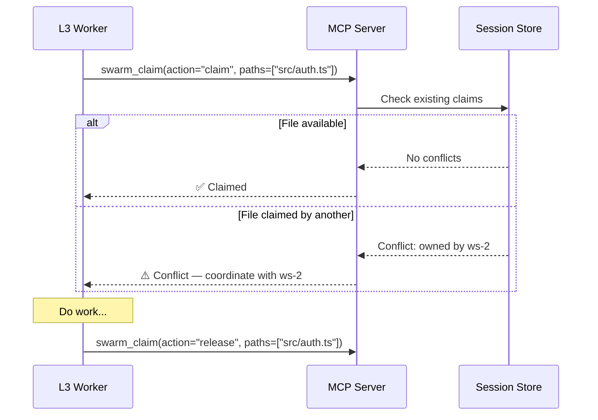

### Worker Consensus Flow

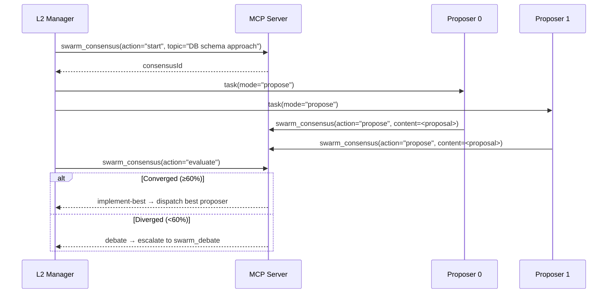

---

## 🔒 Parallel Safety

```
✅ Safe in parallel (read-only):     Explorers, Proposers, Critics
✅ Safe in parallel (non-overlapping): Coders on different files/dirs (with cross-awareness prompts)
⚠️  Sequential only (writes files):   Coders on same files
✅ Safe after coder completes:        Testers
```

---

## 🧠 Anonymous History Format

History is the **backbone** of the system — it IS the cross-communication channel. Each agent sees prior rounds from its own first-person perspective, with **no identity labels**:

```
=== INTERACTION HISTORY ===

[Round 1]
YOUR OUTPUT: {this agent's previous contribution}
OBSERVATION: A contributor analyzed the codebase and found {findings}.
OBSERVATION: Another contributor independently found {other findings}.

[Round 2]
YOUR OUTPUT: {this agent's design/implementation}
OBSERVATION: A contributor implemented {other workstream changes}.  ← cross-communication
CHALLENGE: A contributor identified issues in your work:
  "Issue 1 (critical): {specific issue with evidence}"
  "Issue 2 (major): {specific issue with evidence}"
CHALLENGE: Cross-workstream conflict: {duplicate pattern between workstreams}
SCORES: Correctness 2/3, Responsiveness N/A, Novelty 2/2

=== YOUR TASK (Round 3) ===
Address each challenge. Reference patterns from other workstreams where relevant.
```

> **Key:** The history grows with each round. Later agents see MORE context.
> This is the "in-context learning" from the paper — agents adapt based on accumulated observations.

---

## 📖 Paper Reference

<blockquote>

**Multi-agent cooperation through in-context co-player inference**

Wołczyk, M., Weis, M.A., Nasser, R., Saurous, R.A., Agüera y Arcas, B., Sacramento, J., & Meulemans, A. (2026).

*arXiv:2602.16301* · [PDF](https://arxiv.org/pdf/2602.16301) · [Abstract](https://arxiv.org/abs/2602.16301)

The paper demonstrates that cooperation emerges naturally in multi-agent RL when sequence model agents are trained against diverse co-player pools. Agents develop in-context best-response strategies, become vulnerable to shaping through their adaptiveness, and mutual shaping pressure resolves into cooperative behavior — without explicit meta-learning or centralized coordination.

**Key findings translated into this skill:**
- 🎭 Agent diversity forces in-context strategy inference (§3.1)
- 👤 Anonymous history prevents cooperation collapse (§3.1 ablation)
- 🔗 Cross-communication enables mutual observation and adaptation (§3.2)
- ⚔️ Mutual shaping through adaptiveness drives quality convergence (§3.2)
- 🏗️ Decentralized orchestration — set up interaction, don't dictate outcomes (§4)
- ⏱️ Dual timescale — fast adaptation within a swarm, slow learning across sessions (§1)

</blockquote>

---

## 🗺️ Roadmap

- [x] Core skill with 4 tiered modes (Duo, Trio, Full Swarm, Debate)
- [x] Paper-aligned four rules with quality scoring
- [x] CLI operability rewrite (v3.0 — 68% size reduction)
- [x] Custom agent integration (v4.0 — architect, clean-code, code-review, debugger)
- [x] Fleet mode, plan mode, `/tasks` monitoring integration (v4.0)
- [x] Model strategy aligned with GitHub best practices (v4.0)
- [x] **Blitz tier for massive codebases** (v5.0 — 10+ agents, 50+ files)
- [x] **Cross-communication patterns from paper §3.2** (v5.0)
- [x] **Mandatory review loop enforcement** (v5.0)
- [x] **Merge Protocol after parallel fan-out** (v5.1)
- [x] **MCP Server conversion** (v6.0 — enforced tool calls)
- [x] **OpenCode migration** (v7.0 — per-agent tool restrictions)
- [x] **Provider-based dynamic routing** (v8.0 — future-proof model selection)
- [x] **Convergence metrics** (v8.0 — stalling detection, trend tracking)
- [x] **Anonymous history with identity stripping** (v9.0 — arXiv §3.1)
- [x] **Subprocess mode** (v9.0 — true OS-level parallelism via `opencode run`)
- [x] **Consensus-based merge** (v9.0 — convergence guides synthesis)
- [x] **Unleashed tier** (v10.0 — 32 parallel workstreams, "make it hurt")
- [ ] Cross-session lesson tracking with JSONL persistence
- [ ] Swarm visualization/replay tool
- [ ] Benchmark suite against single-agent baselines
- [ ] Auto-scaling workstream count based on system resources

---

## 📋 Changelog

### v15.0 (2026-02-25)
- **L3 Worker Specialization** — Workers now have domain ROLES (coder, tester, security, architect, documenter, debugger, devops, meta-worker) in addition to provider-based model assignment
- **Intelligent Task Router** — `classifyTaskComplexity()` routes tasks to appropriate model pools (trivial→fast, standard→coder, complex→premium, review→critic)
- **6 new role-specific agent configs** — `worker-coder.md`, `worker-tester.md`, `worker-security.md`, `worker-architect.md`, `worker-documenter.md`, `worker-debugger.md`
- **New `swarm_claim` tool** — File ownership system prevents worker conflicts with claim/release/check/list actions
- **Anti-drift detection** — `checkDrift()` compares worker output against original task goal, flags scope creep and topic drift
- **New `swarm_memory` tool** — Pattern memory: search/store/list successful approaches from prior tasks (requires score ≥8/10)
- **New `swarm_consensus` tool** — Lightweight worker voting for complex decisions: spawn proposers, evaluate convergence, escalate to debate if diverged
- **Self-build capability** — Meta-worker role enables the swarm to modify its own infrastructure with L1 approval gate
- **Role-aware agent assignment** — `getRoleAgentName()` maps worker roles to role-specific agent configs
- **2D worker matrix** — Workers characterized by Role (WHAT they do) × Provider (HOW they think)

### v14.0 (2026-02-24)
- **L2 debate protocol** with partial consensus, fast-track, devil's advocate, and post-implementation validation
- **Partial consensus per-claim tracking** — `extractClaimsFromPositions()`, `updateClaimConsensus()`
- **Fast-track consensus** — Skip unnecessary rounds when Round 1 converges cleanly
- **Devil's advocate / forced dissent** — Auto-assign contrarian when early convergence detected
- **Validation checkpoint** — Post-implementation verification reopens debate if findings diverge

### v13.0 (2026-02-20)
- **Programmatic communication layer** — replaced prompt-based coordination with MCP server state management
- **New `swarm_relay` tool:** Orchestrator posts findings, blockers, decisions to a shared board
- **New `swarm_board` tool:** Orchestrator reads full board state, sees ready/blocked workstreams
- **Auto-relay on submit:** `swarm_submit` automatically posts anonymized output as a board finding
- **Board context injection:** `swarm_next` auto-injects `--- FINDINGS FROM OTHER WORKSTREAMS ---` into worker prompts
- **Anonymous board reads:** Workers never see their OWN findings — only other workstreams' (arXiv §3.2 anonymity)
- **Blocker/decision protocol:** Blockers halt dependent work, decisions resolve them — all tracked in MCP state
- **Workstream dependencies:** New `dependencies` field on workstreams, `getReadyWorkstreams()` enforces ordering
- **Orchestrator as decision-maker:** Premium model only sees facts. All routing, identity stripping, context injection is server-side code.
- 10 MCP tools total (up from 8)

### v12.0 (2026-02-20)
- **3-level agent hierarchy:** Orchestrator → Workers → Sub-agents (arXiv:2602.16301 §3.2)
- Workers now have `task: true` — can spawn sub-agents for complex subtasks
- **Cross-provider diversity enforced:** Workers must dispatch to DIFFERENT providers than themselves
- **Anonymous sub-delegation:** Sub-agents receive task context without parent worker's approach/identity
- **Depth limit = 3:** Sub-agents cannot spawn further sub-agents (prevents runaway trees)
- Workers synthesize sub-agent outputs using paper's convergence/divergence analysis
- Mapped to paper mechanism: diversity → in-context inference → mutual shaping → cooperation

### v11.0 (2026-02-20)
- **OpenCode alignment audit:** 5 critical fixes for native agent system compatibility
- `agent_type` → `subagent_type` — matches OpenCode's Task tool parameter name
- Removed per-call `model` param — model lives on agent config, not per-dispatch
- **Enabled `task: true`** on swarm agent — was completely unable to dispatch subagents before!
- Provider routing via `subagent_type` = worker agent name (not `@mention` syntax)
- `nextAction` strings now include exact `task(subagent_type=..., ...)` call syntax
- **Task mode as default execution:** Swarm agent uses `task()` for subagent dispatch instead of subprocess spawning
- OpenCode `batch` tool documented for guaranteed parallel `task()` execution
- First successful live swarm run with proper orchestrator → task() → worker pipeline

### v10.0 (2026-02-20)
- **Unleashed tier:** 32 parallel workstreams — maximum throughput mode
- Auto-selects on keywords: "unleashed", "make it hurt", "no restraints", "pain"
- Same phase structure as blitz but with 8× the parallelism

### v9.0 (2026-02-20)
- **Subprocess mode:** True OS-level parallelism via `opencode run` background processes
- `swarm_init` accepts `executionMode="subprocess"` — spawns independent terminals
- `swarm_collect` aggregates outputs from subprocess files
- **Anonymous history:** `stripIdentity()` removes all model/agent names from history
- Replaces "Claude Sonnet 4", "GPT-5.2" etc. with "a contributor"
- **Consensus-based merge:** `swarm_merge` now includes convergence metrics
- Stalling detection triggers bold synthesis guidance
- High convergence triggers refinement-focused guidance
- **Swarm agent updated:** `bash` tool enabled for subprocess spawning only

### v8.0 (2026-02-20)
- **Provider-based dynamic routing:** Workers route by provider, not model name
- New worker agents: `worker-anthropic`, `worker-openai`, `worker-gemini`, `worker-haiku`
- Models auto-route — no config changes when new models are added/retired
- **Convergence metrics:** `computeConvergence()` tracks score deltas, stalling, trends
- Included in `swarm_gate` and `swarm_status` responses

### v7.0 (2026-02-20)
- **OpenCode migration:** Moved from Copilot CLI to OpenCode for per-agent tool enforcement
- Swarm agent physically cannot write files (enforced, not just instructed)
- `swarm.md` agent config with explicit tool permissions
- GitHub Copilot provider integration via device auth flow

### v6.0 (2026-02-19)
- **MCP Server:** Converted from prose-based skill to enforced MCP tool calls
- Server-side model diversity, phase ordering, merge enforcement, quality gates
- 8 tools: `swarm_init`, `swarm_next`, `swarm_submit`, `swarm_merge`, `swarm_status`, `swarm_gate`, `swarm_collect`, `swarm_models`
- Anonymous history built server-side — agent never sees identity labels
- Deployed via ToolHive (`thv run`)

### v5.2 (2026-02-19)
- Programmatic state machine with SQL enforcement
- Auto pre-flight (fleet/plan mode prompts)
- STOP-AND-CHECK gates, anti-pattern callouts
- Phase continuation enforcement

### v5.1 (2026-02-19)
- **Merge Protocol:** Formal synthesis step after every parallel fan-out phase (inspired by Agent Framework's ConcurrentBuilder)
- Lightweight haiku merge agent deduplicates findings, preserves unique insights, flags contradictions
- Applied to all parallel phases across Full Swarm and Blitz tiers
- Replaces ad-hoc "collect and concatenate" with structured anonymous documents

### v5.0 (2026-02-19)
- **Blitz tier:** Maximum throughput mode for massive codebases (10+ agents, 50+ files)
- **Cross-communication (Rule 4):** Parallel coders see other workstreams, critics check integration
- **Mandatory review:** Review loop can no longer be skipped — enforced as MANDATORY GATE
- **Cross-workstream integration check:** New phase in Full Swarm and Blitz
- **Explorer model fix:** All explorers now explicitly use `model="claude-haiku-4.5"`
- **Parallel critics:** Blitz tier splits review across multiple critics for speed
- **Richer history format:** History includes cross-workstream observations and conflicts

### v4.0 (2026-02-19)
- **Custom agents:** Uses `architect`, `clean-code`, `code-review`, `debugger` instead of generic prompts
- **Fleet mode:** Pre-flight `/fleet` for parallel subagent execution
- **Plan mode:** `/plan` recommended for Full Swarm and Debate tiers
- **Model strategy:** Aligned with GitHub's best practices (Opus for reasoning, Codex for review)
- **Monitoring:** `/tasks` for tracking subagents, `/context` for token management
- **Fixed:** Debate examples missing `agent_type`, cross-session path corrected
- **Trimmed:** Removed redundant prompt templates (custom agents have built-in prompts)

### v3.0 (2026-02-19)
- Rewrote for CLI operability: 733→232 lines (68% reduction)
- Fixed task tool syntax, parallel safety rules, SQL persistence model
- Moved execution checklists to top of file

### v2.0 (2026-02-19)
- Paper-alignment audit: 9 improvements from ablation experiments
- Added co-player inference, anonymous history, quality scoring, dual timescale

### v1.0 (2026-02-19)
- Initial release with 6 agent archetypes and 3 orchestration modes

---

## 📄 License

[MIT](LICENSE) — use it, fork it, swarm it.

---

<div align="center">

*Built with 🐝 by [Tim Schwarz](https://github.com/schwarztim) and [GitHub Copilot](https://github.com/features/copilot)*

**Cooperation isn't programmed. It emerges.**

</div>
