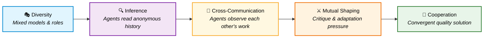
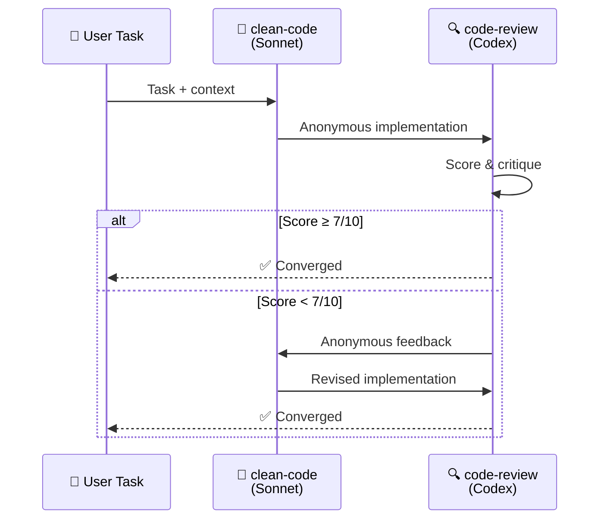
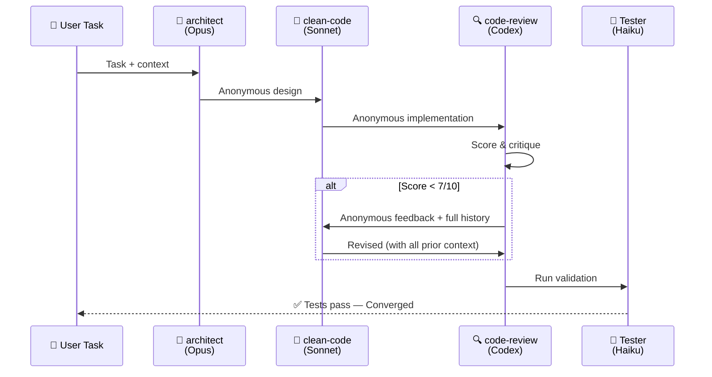
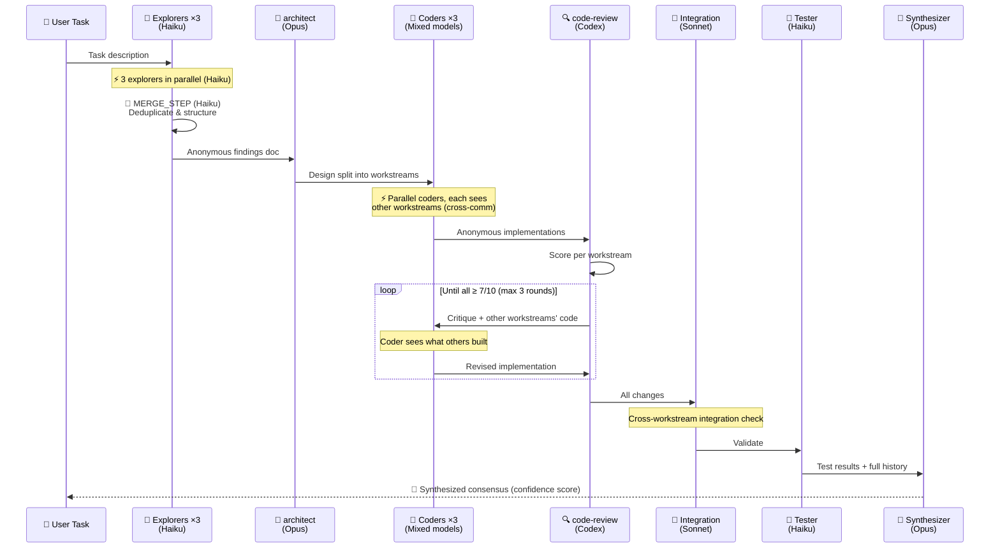
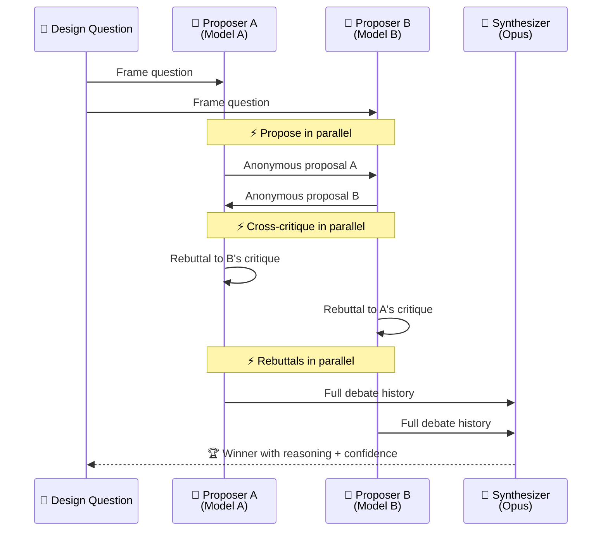
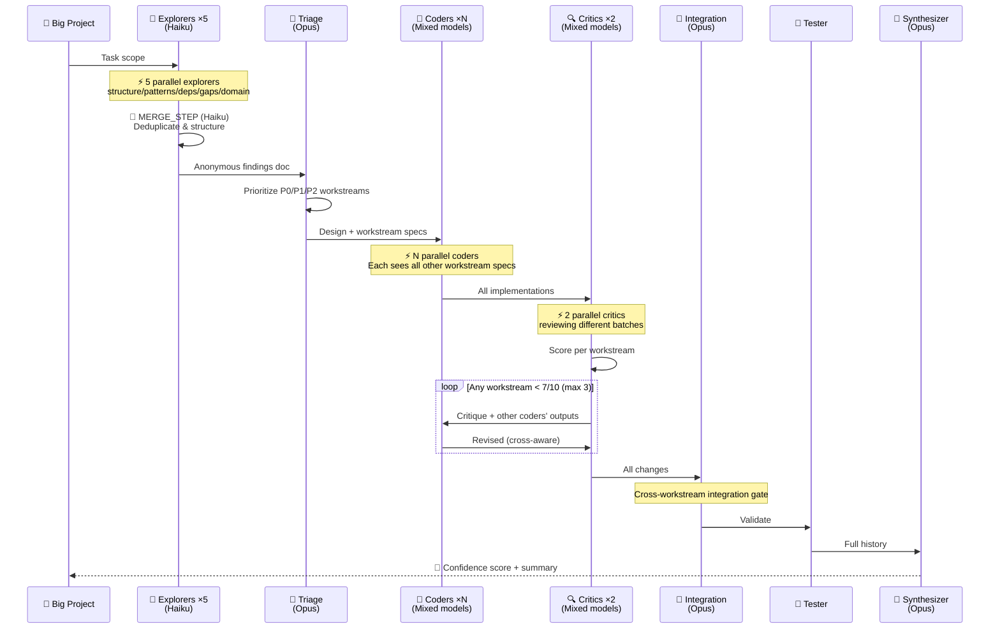

<div align="center">

# 🐝 Open Swarm

### MCP Server + Copilot CLI Skill for Emergent Multi-Agent Cooperation

[](https://opensource.org/licenses/MIT)
[](https://docs.github.com/copilot)
[](https://modelcontextprotocol.io)
[](https://arxiv.org/abs/2602.16301)
[](#changelog)

*Cooperation isn't programmed — it **emerges**.*

---

</div>

## 💡 The Idea

Traditional multi-agent systems use a **central coordinator** that tells each agent what to do. This skill takes a fundamentally different approach based on research from [arXiv:2602.16301](https://arxiv.org/abs/2602.16301) (Wołczyk, Weis, Nasser et al., 2026):

> **Cooperation emerges naturally** when diverse agents adapt to each other through anonymous interaction history and mutual shaping pressure.

No central brain. No rigid pipelines. Just diverse agents reading each other's work, adapting, challenging, and converging on quality.

```
Traditional:     Controller → Agent A → Agent B → Agent C → Output
                     ↑ centralized decisions at every step

Swarm:           Agent A ←→ Agent B ←→ Agent C → Consensus
                     ↑ agents shape each other through interaction
```

---

## 🧬 How It Works — The Paper's Mechanism

The paper identifies a causal chain that produces cooperation (§3.2). This skill translates each step into practical agent orchestration:



| Step | Paper Mechanism | Skill Implementation |
|------|----------------|---------------------|
| **1. Diversity** | Train agents against diverse co-player pool (§3.1) | Use ≥2 different LLM models (Opus, Sonnet, GPT, Gemini) |
| **2. In-Context Inference** | Agents infer co-player strategy from observations (§3.2) | Each agent receives full anonymous interaction history |
| **3. Cross-Communication** | Agents observe and react to each other's outputs (§3.2) | Parallel coders see other workstreams; critics see all changes |
| **4. Mutual Shaping** | Adaptiveness creates vulnerability → pressure to cooperate (§3.2) | Critics score work; low scores trigger revision with cross-awareness |
| **5. Convergence** | Cooperation emerges as stable equilibrium (§4) | Quality ≥7/10 across all agents → consensus achieved |

---

## 🛫 Pre-Flight Setup

Before launching a swarm, these Copilot CLI commands optimize the experience:

```
/fleet                  # Enable parallel subagent execution (essential for swarms)
/plan                   # Use plan mode first for Full Swarm or Debate tiers
/context                # Check available token space before starting
/tasks                  # Monitor running subagents during swarm execution
```

> **💡 Key insight:** Each subagent runs in **its own context window**. This means swarms don't bloat your main conversation — it's actually *more* token-efficient than doing everything in one thread.

---

## 🤖 Leverages Existing Custom Agents

The skill uses Copilot CLI's built-in custom agents instead of reinventing prompts:

| Swarm Role | Custom Agent | Why |
|-----------|-------------|-----|
| **Architect** | `agent_type="architect"` | Already has rich design principles, ADR templates, pattern guidance |
| **Coder** | `agent_type="clean-code"` | Clean Code principles, SOLID, naming conventions built-in |
| **Critic** | `agent_type="code-review"` | High signal-to-noise ratio — only surfaces real issues |
| **Debugger** | `agent_type="debugger"` | Scientific debugging method, hypothesis-driven investigation |
| **Explorer** | `agent_type="explore"` | Fast codebase analysis, read-only, parallel-safe |
| **Tester** | `agent_type="task"` | Command execution with brief success/full failure output |

Only **swarm-specific roles** (Synthesizer, Critic override with scoring) need explicit prompts.

---

## 🏗️ Architecture

### Orchestration Flow


### Tiered Modes

<table>
<tr>
<td width="20%" align="center">

**🟢 Duo**
<br/>2 agents · ~3 calls
<br/><sub>Implementation + review</sub>

</td>
<td width="20%" align="center">

**🟡 Trio**
<br/>3 agents · ~6 calls
<br/><sub>Design + code + validation</sub>

</td>
<td width="20%" align="center">

**🔴 Full Swarm**
<br/>6+ agents · ~14 calls
<br/><sub>Architecture, security-critical</sub>

</td>
<td width="20%" align="center">

**⚡ Blitz**
<br/>10+ agents · ~20+ calls
<br/><sub>Massive codebases, 50+ files</sub>

</td>
<td width="20%" align="center">

**🟣 Debate**
<br/>N+1 agents · ~3N+1 calls
<br/><sub>Design decisions, tradeoffs</sub>

</td>
</tr>
</table>

---

## 🔄 Detailed Flows

### Duo Flow



### Trio Flow



### Full Swarm Flow



### Debate Flow



### Blitz Flow (Maximum Throughput)



---

## 🔗 Cross-Communication (Paper §3.2)

The paper's core finding: **cooperation emerges through mutual observation and adaptation, not isolation**.

Cross-communication isn't about agents chatting — it's about agents **seeing each other's outputs
in the anonymous history** and adapting their behavior. This is what drives quality:

```
Traditional (broken):     Coder A → isolated output
                          Coder B → isolated output
                          ↳ No awareness of each other → conflicts, duplication

With cross-communication: Coder A builds, sees "Other workstreams: {B's scope, C's scope}"
                          Coder B builds, sees "Other workstreams: {A's scope, C's scope}"
                          Critic reviews ALL → feeds critique + others' code back
                          Coder A revises, now sees B's actual code + critique
                          ↳ Mutual awareness → shared patterns, no conflicts
```

**Where cross-communication is applied:**

| Phase | Cross-Communication | Why |
|-------|-------------------|-----|
| Parallel coders | Each prompt includes other workstream summaries | Avoids duplication, shares patterns |
| Review feedback loop | Critique includes other coders' outputs | Coder adapts knowing full picture |
| Integration check | All workstreams reviewed together | Catches conflicts between pieces |
| Debate critiques | Each proposer reads the OTHER proposals | Forces genuine engagement |

**Where it's NOT needed** (would just slow things down):
- Explorers — gathering facts independently is faster and more thorough
- Sequential steps — already get full history naturally

---

## 📊 Quality Scoring System

Every contribution is scored to create the **gradient pressure** that drives improvement:

```
┌─────────────────────────────────────────────────────┐
│                  QUALITY SCORE                       │
│                                                     │
│  Correctness      ████████░░  2/3  Solves problem?  │
│  Responsiveness   █████████░  3/3  Addressed feedback│
│  Constructiveness ██████░░░░  1/2  Improved quality? │
│  Novelty          ████████░░  2/2  New insights?     │
│                   ─────────────────                  │
│  Total                        8/10  → ✅ Converged   │
│                                                     │
│  ≥7  = Converge    <5 = Another round    Max: 3     │
└─────────────────────────────────────────────────────┘
```

---

## 📜 Four Rules

These aren't suggestions — they're **empirically validated** by the paper's ablation experiments (§3.1, §3.2). Violating any one causes cooperation to collapse:

<table>
<tr>
<td width="25%" align="center">

### 🎭 Rule 1
**Use Diverse Models**

Same model for all agents produces agreeable, mediocre output. Use ≥2 different models.

*Paper §3.1: no diversity = defection*

</td>
<td width="25%" align="center">

### 👤 Rule 2
**Keep History Anonymous**

Never label contributions with role names. Say *"A previous contributor proposed..."*

*Paper §3.1 ablation: explicit IDs = defection*

</td>
<td width="25%" align="center">

### 📋 Rule 3
**Pass Full History**

Every agent gets the complete interaction sequence. Never truncate or summarize away rounds.

*Paper §A.2: no history = no adaptation*

</td>
<td width="25%" align="center">

### 🔗 Rule 4
**Cross-Communicate**

Parallel agents must see each other's outputs where relevant. Isolation produces mediocre work.

*Paper §3.2: mutual shaping drives cooperation*

</td>
</tr>
</table>

---

## 🧩 Model Strategy

Aligned with [GitHub's best practices](https://docs.github.com/copilot/how-tos/copilot-cli/cli-best-practices):

| Role | Model | Rationale |
|------|-------|-----------|
| **Architect / Synthesizer** | Claude Opus | Complex reasoning, system design, nuanced decisions |
| **Coder** | Claude Sonnet | Day-to-day implementation, fast and cost-effective |
| **Critic** | GPT Codex | Excellent for reviewing code produced by other models |
| **Explorer / Tester** | Claude Haiku | Fast read-only tasks, minimal token cost |

> The key is **model diversity** — using the same model for all roles produces agreeable but mediocre output. Cross-model review catches issues same-model review misses.

---

## 🚀 Installation

### Option A: MCP Server (Recommended — enforced orchestration)

```bash
# Build and run with ToolHive
cd mcp-server
docker build -t localhost:5555/open-swarm-mcp:latest .
docker push localhost:5555/open-swarm-mcp:latest
thv run localhost:5555/open-swarm-mcp:latest --name open-swarm --transport stdio

# Verify
thv list | grep open-swarm
```

Then register with Copilot CLI — add to `~/.copilot/mcp-config.json`:
```json
{
  "mcpServers": {
    "open-swarm": {
      "type": "http",
      "url": "http://127.0.0.1:<PORT>/mcp"
    }
  }
}
```
Replace `<PORT>` with the port from `thv list` output.

Then install the thin SKILL.md wrapper:
```bash
mkdir -p ~/.copilot/skills/swarm-orchestrator && \
  curl -sL https://raw.githubusercontent.com/schwarztim/open-swarm/main/SKILL.md \
  -o ~/.copilot/skills/swarm-orchestrator/SKILL.md
```

### Option B: Skill Only (no server needed)

```bash
mkdir -p ~/.copilot/skills/swarm-orchestrator && \
  curl -sL https://raw.githubusercontent.com/schwarztim/open-swarm/main/SKILL.md \
  -o ~/.copilot/skills/swarm-orchestrator/SKILL.md
```

### MCP Server Tools

| Tool | Purpose |
|------|---------|
| `swarm_init` | Initialize session, auto-select tier |
| `swarm_next` | Get exact task() params for current phase |
| `swarm_submit` | Submit completed output, advance state |
| `swarm_merge` | Merge parallel outputs anonymously |
| `swarm_status` | Full session state + next action |
| `swarm_gate` | Quality gate: proceed or retry |

Restart Copilot CLI, or run `/skills reload` if already in a session. The skill appears in `/skills`.

### Verify Installation

```
> /skills list
# Should list "swarm-orchestrator" with description

> /skills info
# Shows skill location and details
```

### Invocation

```
# Explicit invocation
/swarm-orchestrator

# Natural language (Copilot auto-detects)
"swarm this"
"debate the best approach"
"use the swarm-orchestrator skill to..."
```

---

## 🎯 Usage Examples

### Quick — Duo

> *"Add input validation to the user registration endpoint"*

Copilot auto-selects **Duo** (single-file change + review), spawns a Coder (Sonnet) and Critic (GPT), converges in ~2 rounds.

### Medium — Trio

> *"Add rate limiting middleware to all API endpoints"*

Copilot selects **Trio** — Architect designs the approach, Coder implements, Critic reviews, Tester validates.

### Complex — Full Swarm

> *"Refactor the authentication system from session-based to JWT with refresh tokens"*

Copilot selects **Full Swarm** — Explorers map the auth code in parallel, Architect designs migration, Coder implements, Critic catches edge cases, Tester validates, Synthesizer produces final output with confidence score.

### Decision — Debate

> *"Should we use GraphQL or REST for the new API?"*

Copilot selects **Debate** — two proposers argue for each approach with different models, cross-critique, rebut, then Synthesizer picks a winner with reasoning.

### Massive — Blitz

> *"Swarm this: ~/Projects/my-platform — there's a lot of unwired logic and stubs that need to be completed"*

Copilot selects **Blitz** — 5 parallel explorers (structure/patterns/deps/gaps/domain) recon the codebase, Architect triages into P0/P1/P2 workstreams, N parallel coders build simultaneously with cross-awareness of each other's workstreams, parallel critics review in batches, integration check catches cross-workstream conflicts, Synthesizer produces confidence score.

---

## 🔒 Parallel Safety

```
✅ Safe in parallel (read-only):     Explorers, Proposers, Critics
✅ Safe in parallel (non-overlapping): Coders on different files/dirs (with cross-awareness prompts)
⚠️  Sequential only (writes files):   Coders on same files
✅ Safe after coder completes:        Testers
```

---

## 🧠 Anonymous History Format

History is the **backbone** of the system — it IS the cross-communication channel. Each agent sees prior rounds from its own first-person perspective, with **no identity labels**:

```
=== INTERACTION HISTORY ===

[Round 1]
YOUR OUTPUT: {this agent's previous contribution}
OBSERVATION: A contributor analyzed the codebase and found {findings}.
OBSERVATION: Another contributor independently found {other findings}.

[Round 2]
YOUR OUTPUT: {this agent's design/implementation}
OBSERVATION: A contributor implemented {other workstream changes}.  ← cross-communication
CHALLENGE: A contributor identified issues in your work:
  "Issue 1 (critical): {specific issue with evidence}"
  "Issue 2 (major): {specific issue with evidence}"
CHALLENGE: Cross-workstream conflict: {duplicate pattern between workstreams}
SCORES: Correctness 2/3, Responsiveness N/A, Novelty 2/2

=== YOUR TASK (Round 3) ===
Address each challenge. Reference patterns from other workstreams where relevant.
```

> **Key:** The history grows with each round. Later agents see MORE context.
> This is the "in-context learning" from the paper — agents adapt based on accumulated observations.

---

## 📖 Paper Reference

<blockquote>

**Multi-agent cooperation through in-context co-player inference**

Wołczyk, M., Weis, M.A., Nasser, R., Saurous, R.A., Agüera y Arcas, B., Sacramento, J., & Meulemans, A. (2026).

*arXiv:2602.16301* · [PDF](https://arxiv.org/pdf/2602.16301) · [Abstract](https://arxiv.org/abs/2602.16301)

The paper demonstrates that cooperation emerges naturally in multi-agent RL when sequence model agents are trained against diverse co-player pools. Agents develop in-context best-response strategies, become vulnerable to shaping through their adaptiveness, and mutual shaping pressure resolves into cooperative behavior — without explicit meta-learning or centralized coordination.

**Key findings translated into this skill:**
- 🎭 Agent diversity forces in-context strategy inference (§3.1)
- 👤 Anonymous history prevents cooperation collapse (§3.1 ablation)
- 🔗 Cross-communication enables mutual observation and adaptation (§3.2)
- ⚔️ Mutual shaping through adaptiveness drives quality convergence (§3.2)
- 🏗️ Decentralized orchestration — set up interaction, don't dictate outcomes (§4)
- ⏱️ Dual timescale — fast adaptation within a swarm, slow learning across sessions (§1)

</blockquote>

---

## 🗺️ Roadmap

- [x] Core skill with 4 tiered modes (Duo, Trio, Full Swarm, Debate)
- [x] Paper-aligned three rules with quality scoring
- [x] CLI operability rewrite (v3.0 — 68% size reduction)
- [x] Custom agent integration (v4.0 — architect, clean-code, code-review, debugger)
- [x] Fleet mode, plan mode, `/tasks` monitoring integration (v4.0)
- [x] Model strategy aligned with GitHub best practices (v4.0)
- [x] **Blitz tier for massive codebases** (v5.0 — 10+ agents, 50+ files)
- [x] **Cross-communication patterns from paper §3.2** (v5.0)
- [x] **Mandatory review loop enforcement** (v5.0)
- [x] **Parallel coders with workstream awareness** (v5.0)
- [x] **Merge Protocol after parallel fan-out** (v5.1 — inspired by Agent Framework)
- [ ] Companion agent definition (`~/.copilot/agents/swarm-orchestrator.agent.md`)
- [ ] Cross-session lesson tracking with JSONL persistence
- [ ] Automated tier selection heuristics
- [ ] Plugin packaging for `/plugin install`
- [ ] Swarm visualization/replay tool
- [ ] Benchmark suite against single-agent baselines

---

## 📋 Changelog

### v6.0 (2026-02-19)
- **MCP Server:** Converted from prose-based skill to enforced MCP tool calls
- Server-side model diversity, phase ordering, merge enforcement, quality gates
- 6 tools: `swarm_init`, `swarm_next`, `swarm_submit`, `swarm_merge`, `swarm_status`, `swarm_gate`
- Anonymous history built server-side — agent never sees identity labels
- SKILL.md reduced from 399→72 lines (thin wrapper pointing to MCP tools)
- Deployed via ToolHive (`thv run`)

### v5.2 (2026-02-19)
- Programmatic state machine with SQL enforcement
- Auto pre-flight (fleet/plan mode prompts)
- STOP-AND-CHECK gates, anti-pattern callouts
- Phase continuation enforcement

### v5.1 (2026-02-19)
- **Merge Protocol:** Formal synthesis step after every parallel fan-out phase (inspired by Agent Framework's ConcurrentBuilder)
- Lightweight haiku merge agent deduplicates findings, preserves unique insights, flags contradictions
- Applied to all parallel phases across Full Swarm and Blitz tiers
- Replaces ad-hoc "collect and concatenate" with structured anonymous documents

### v5.0 (2026-02-19)
- **Blitz tier:** Maximum throughput mode for massive codebases (10+ agents, 50+ files)
- **Cross-communication (Rule 4):** Parallel coders see other workstreams, critics check integration
- **Mandatory review:** Review loop can no longer be skipped — enforced as MANDATORY GATE
- **Cross-workstream integration check:** New phase in Full Swarm and Blitz
- **Explorer model fix:** All explorers now explicitly use `model="claude-haiku-4.5"`
- **Parallel critics:** Blitz tier splits review across multiple critics for speed
- **Richer history format:** History includes cross-workstream observations and conflicts

### v4.0 (2026-02-19)
- **Custom agents:** Uses `architect`, `clean-code`, `code-review`, `debugger` instead of generic prompts
- **Fleet mode:** Pre-flight `/fleet` for parallel subagent execution
- **Plan mode:** `/plan` recommended for Full Swarm and Debate tiers
- **Model strategy:** Aligned with GitHub's best practices (Opus for reasoning, Codex for review)
- **Monitoring:** `/tasks` for tracking subagents, `/context` for token management
- **Fixed:** Debate examples missing `agent_type`, cross-session path corrected
- **Trimmed:** Removed redundant prompt templates (custom agents have built-in prompts)

### v3.0 (2026-02-19)
- Rewrote for CLI operability: 733→232 lines (68% reduction)
- Fixed task tool syntax, parallel safety rules, SQL persistence model
- Moved execution checklists to top of file

### v2.0 (2026-02-19)
- Paper-alignment audit: 9 improvements from ablation experiments
- Added co-player inference, anonymous history, quality scoring, dual timescale

### v1.0 (2026-02-19)
- Initial release with 6 agent archetypes and 3 orchestration modes

---

## 📄 License

[MIT](LICENSE) — use it, fork it, swarm it.

---

<div align="center">

*Built with 🐝 by [Tim Schwarz](https://github.com/schwarztim) and [GitHub Copilot](https://github.com/features/copilot)*

**Cooperation isn't programmed. It emerges.**

</div>
