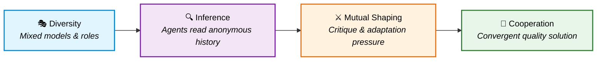
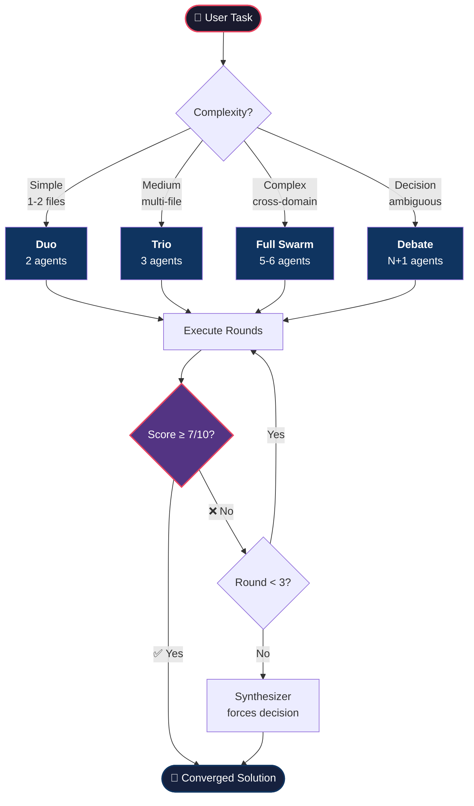
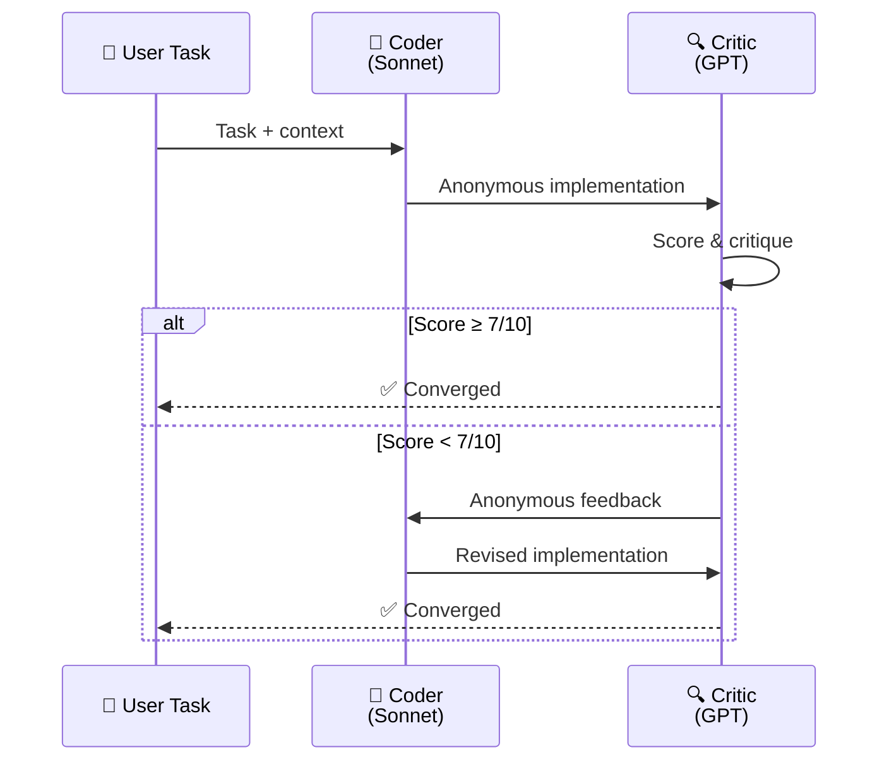
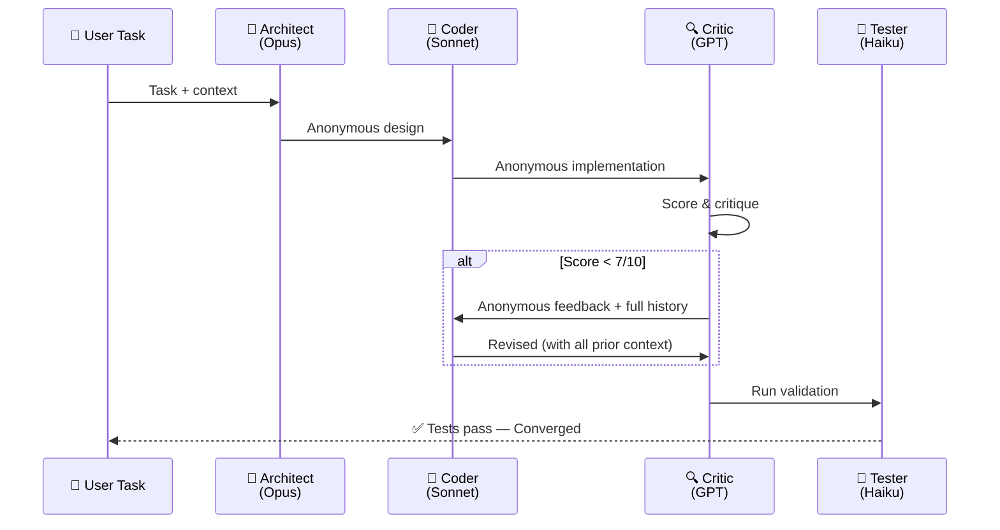
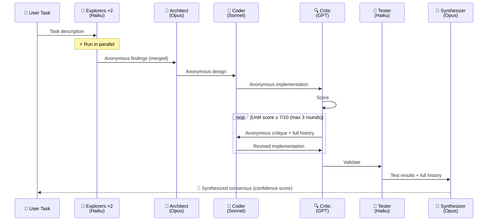
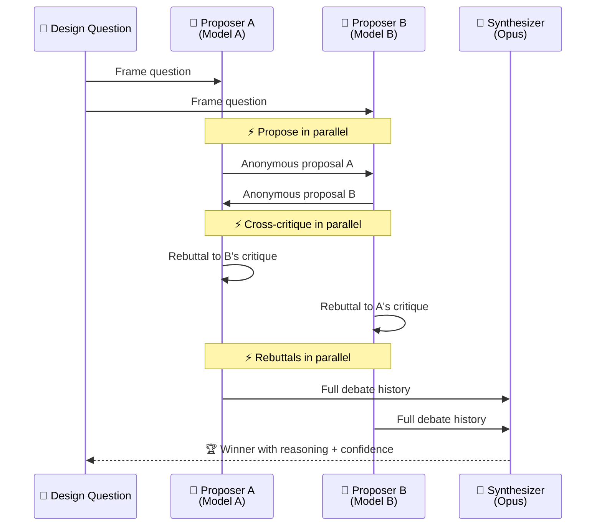

<div align="center">

# 🐝 Swarm Orchestrator

### A Copilot CLI Skill for Emergent Multi-Agent Cooperation

[](https://opensource.org/licenses/MIT)
[](https://docs.github.com/copilot)
[](https://arxiv.org/abs/2602.16301)
[](#changelog)

*Cooperation isn't programmed — it **emerges**.*

---

</div>

## 💡 The Idea

Traditional multi-agent systems use a **central coordinator** that tells each agent what to do. This skill takes a fundamentally different approach based on research from [arXiv:2602.16301](https://arxiv.org/abs/2602.16301) (Wołczyk, Weis, Nasser et al., 2026):

> **Cooperation emerges naturally** when diverse agents adapt to each other through anonymous interaction history and mutual shaping pressure.

No central brain. No rigid pipelines. Just diverse agents reading each other's work, adapting, challenging, and converging on quality.

```
Traditional:     Controller → Agent A → Agent B → Agent C → Output
                     ↑ centralized decisions at every step

Swarm:           Agent A ←→ Agent B ←→ Agent C → Consensus
                     ↑ agents shape each other through interaction
```

---

## 🧬 How It Works — The 4-Step Mechanism

The paper identifies a causal chain that produces cooperation. This skill translates each step into practical agent orchestration:



| Step | Paper Mechanism | Skill Implementation |
|------|----------------|---------------------|
| **1. Diversity** | Train agents against diverse co-player pool | Use ≥2 different LLM models (Opus, Sonnet, GPT, Gemini) |
| **2. In-Context Inference** | Agents infer co-player strategy from observations | Each agent receives full anonymous interaction history |
| **3. Mutual Shaping** | Adaptiveness creates vulnerability → pressure to cooperate | Critics score work; low scores trigger revision rounds |
| **4. Convergence** | Cooperation emerges as stable equilibrium | Quality ≥7/10 across all agents → consensus achieved |

---

## 🏗️ Architecture

### Orchestration Flow



### Tiered Modes

<table>
<tr>
<td width="25%" align="center">

**🟢 Duo**
<br/>2 agents · ~3 calls
<br/><sub>Implementation + review</sub>

</td>
<td width="25%" align="center">

**🟡 Trio**
<br/>3 agents · ~6 calls
<br/><sub>Design + code + validation</sub>

</td>
<td width="25%" align="center">

**🔴 Full Swarm**
<br/>5-6 agents · ~12 calls
<br/><sub>Architecture, security-critical</sub>

</td>
<td width="25%" align="center">

**🟣 Debate**
<br/>N+1 agents · ~3N+1 calls
<br/><sub>Design decisions, tradeoffs</sub>

</td>
</tr>
</table>

---

## 🔄 Detailed Flows

### Duo Flow



### Trio Flow



### Full Swarm Flow



### Debate Flow



---

## 📊 Quality Scoring System

Every contribution is scored to create the **gradient pressure** that drives improvement:

```
┌─────────────────────────────────────────────────────┐
│                  QUALITY SCORE                       │
│                                                     │
│  Correctness      ████████░░  2/3  Solves problem?  │
│  Responsiveness   █████████░  3/3  Addressed feedback│
│  Constructiveness ██████░░░░  1/2  Improved quality? │
│  Novelty          ████████░░  2/2  New insights?     │
│                   ─────────────────                  │
│  Total                        8/10  → ✅ Converged   │
│                                                     │
│  ≥7  = Converge    <5 = Another round    Max: 3     │
└─────────────────────────────────────────────────────┘
```

---

## 📜 Three Rules

These aren't suggestions — they're **empirically validated** by the paper's ablation experiments. Violating any one causes cooperation to collapse:

<table>
<tr>
<td width="33%" align="center">

### 🎭 Rule 1
**Use Diverse Models**

Same model for all agents produces agreeable, mediocre output. Use ≥2 different models.

*Paper §3.1: no diversity = defection*

</td>
<td width="33%" align="center">

### 👤 Rule 2
**Keep History Anonymous**

Never label contributions with role names. Say *"A previous contributor proposed..."*

*Paper §3.1 ablation: explicit IDs = defection*

</td>
<td width="33%" align="center">

### 📋 Rule 3
**Pass Full History**

Every agent gets the complete interaction sequence. Never truncate or summarize away rounds.

*Paper §A.2: no history = no adaptation*

</td>
</tr>
</table>

---

## 🚀 Installation

```bash
# One-liner install
mkdir -p ~/.copilot/skills/swarm-orchestrator && \
  curl -sL https://raw.githubusercontent.com/schwarztim/swarm-orchestrator-skill/main/SKILL.md \
  -o ~/.copilot/skills/swarm-orchestrator/SKILL.md
```

Or clone the repo:

```bash
git clone https://github.com/schwarztim/swarm-orchestrator-skill.git
cp swarm-orchestrator-skill/SKILL.md ~/.copilot/skills/swarm-orchestrator/SKILL.md
```

Restart Copilot CLI. The skill appears in `/skills`.

### Verify Installation

```
> /skills
# Should list "swarm-orchestrator" with description
```

---

## 🎯 Usage Examples

### Quick — Duo

> *"Add input validation to the user registration endpoint"*

Copilot auto-selects **Duo** (single-file change + review), spawns a Coder (Sonnet) and Critic (GPT), converges in ~2 rounds.

### Medium — Trio

> *"Add rate limiting middleware to all API endpoints"*

Copilot selects **Trio** — Architect designs the approach, Coder implements, Critic reviews, Tester validates.

### Complex — Full Swarm

> *"Refactor the authentication system from session-based to JWT with refresh tokens"*

Copilot selects **Full Swarm** — Explorers map the auth code in parallel, Architect designs migration, Coder implements, Critic catches edge cases, Tester validates, Synthesizer produces final output with confidence score.

### Decision — Debate

> *"Should we use GraphQL or REST for the new API?"*

Copilot selects **Debate** — two proposers argue for each approach with different models, cross-critique, rebut, then Synthesizer picks a winner with reasoning.

---

## 🔒 Parallel Safety

```
✅ Safe in parallel (read-only):     Explorers, Proposers, Critics
⚠️  Sequential only (writes files):   Coders, Architects
✅ Safe after coder completes:        Testers
```

---

## 🧠 Anonymous History Format

History is the **backbone** of the system. Each agent sees prior rounds from its own first-person perspective, with **no identity labels**:

```
=== INTERACTION HISTORY ===

[Round 1]
YOUR OUTPUT: {this agent's previous contribution}
OBSERVATION: A contributor analyzed the codebase and found {findings}.
OBSERVATION: Another contributor independently found {other findings}.

[Round 2]
YOUR OUTPUT: {this agent's design/implementation}
CHALLENGE: A contributor identified issues in your work:
  "Issue 1 (critical): {specific issue with evidence}"
  "Issue 2 (major): {specific issue with evidence}"
SCORES: Correctness 2/3, Responsiveness N/A, Novelty 2/2

=== YOUR TASK (Round 3) ===
Address each challenge with evidence, then provide your updated contribution.
```

---

## 📖 Paper Reference

<blockquote>

**Multi-agent cooperation through in-context co-player inference**

Wołczyk, M., Weis, M.A., Nasser, R., Saurous, R.A., Agüera y Arcas, B., Sacramento, J., & Meulemans, A. (2026).

*arXiv:2602.16301* · [PDF](https://arxiv.org/pdf/2602.16301) · [Abstract](https://arxiv.org/abs/2602.16301)

The paper demonstrates that cooperation emerges naturally in multi-agent RL when sequence model agents are trained against diverse co-player pools. Agents develop in-context best-response strategies, become vulnerable to shaping through their adaptiveness, and mutual shaping pressure resolves into cooperative behavior — without explicit meta-learning or centralized coordination.

**Key findings translated into this skill:**
- 🎭 Agent diversity forces in-context strategy inference (§3.1)
- 👤 Anonymous history prevents cooperation collapse (§3.1 ablation)
- ⚔️ Mutual shaping through adaptiveness drives quality convergence (§3.2)
- 🏗️ Decentralized orchestration — set up interaction, don't dictate outcomes (§4)
- ⏱️ Dual timescale — fast adaptation within a swarm, slow learning across sessions (§1)

</blockquote>

---

## 🗺️ Roadmap

- [ ] Companion agent definition (`~/.copilot/agents/swarm-orchestrator.agent.md`)
- [ ] Cross-session lesson tracking with JSONL persistence
- [ ] Automated tier selection heuristics
- [ ] Swarm visualization/replay tool
- [ ] Benchmark suite against single-agent baselines

---

## 📄 License

[MIT](LICENSE) — use it, fork it, swarm it.

---

<div align="center">

*Built with 🐝 by [Tim Schwarz](https://github.com/schwarztim) and [GitHub Copilot](https://github.com/features/copilot)*

**Cooperation isn't programmed. It emerges.**

</div>
